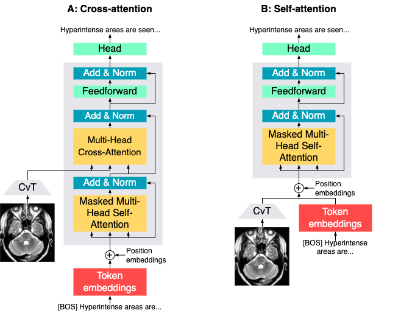

# MedICap: A Concise Model for Medical Image Captioning

MedICap is a medical image captioning model that placed first in the ImageCLEFmedical Caption 2023 challenge: https://www.imageclef.org/2023/medical/caption (team CSIRO). It is available on the Hugging Face Hub: https://huggingface.co/aehrc/medicap. It is presented in the working notes and at CLEF 2023.

#### Working notes:

https://www.dei.unipd.it/~faggioli/temp/CLEF2023-proceedings/paper-132.pdf

#### BibTeX:
```bibtex
@inproceedings{nicolson_aehrc_2021,
	address = {Thessaloniki, Greece},
	title = {A {C}oncise {M}odel for {M}edical {I}mage {C}aptioning},
	copyright = {All rights reserved},
	language = {en},
	booktitle = {Proceedings of the 14th {International} {Conference} of the {CLEF} {Association}},
	author = {Nicolson, Aaron and Dowling, Jason and Koopman, Bevan},
	month = sep,
	year = {2023},
}
```

||
|----|
| <p align="center"> <a> Decoder conditioned on the visual features of the image via A) the cross-attention, and B) the self-attention. The visual features are extracted with the encoder. CC BY [Muacevic et al. (2022)]. 𝑁 is the number of Transformer blocks. `[BOS]` is the beginning-of-sentence special token. </a> </p> |

# Hugging Face model & checkpoint:

 The Hugging Face model & checkpoint is available at: https://huggingface.co/aehrc/medicap.


# Notebook example:
An example of MedICap generating captions is given in `example.ipynb`.

# Installation:
After cloning the repository, install the required packages in a virtual environment.
The required packages are located in `requirements.txt`:
```shell script
python -m venv --system-site-packages venv
source venv/bin/activate
python -m pip install --upgrade pip
python -m pip install --upgrade -r requirements.txt --no-cache-dir
```

# Test the Hugging Face checkpoints:   

To test the Hugging Face model:

```shell
dlhpcstarter -t imageclefmed_caption_2023_hf -c config/test_huggingface/007_no_ca_scst.yaml --stages_module tools.stages --test
```

See [`dlhpcstarter==0.1.4`](https://github.com/csiro-mlai/dl_hpc_starter_pack) for more options. 

Note: data will be saved in the experiment directory (`exp_dir` in the configuration file).

# Training:
   
To train with teacher forcing:
 
```
dlhpcstarter -t imageclefmed_caption_2023 -c config/train/002_no_ca.yaml --stages_module tools.stages --train
```

The model can then be tested with the `--test` flag:

```
dlhpcstarter -t imageclefmed_caption_2023 -c config/train/002_no_ca.yaml --stages_module tools.stages --test
```

To then train with Self-Critical Sequence Training (SCST) with the BERTScore reward:

 1. Copy the path to the checkpoint from the `exp_dir` for the configuration above, then paste it in the configuration for SCST as `warm_start_ckpt_path`, then:
 2. 
    ```
    dlhpcstarter -t mimic_cxr -c config/train/007_no_ca_scst.yaml --stages_module tools.stages --train
    ```

See [`dlhpcstarter==0.1.4`](https://github.com/csiro-mlai/dl_hpc_starter_pack) for more options. 

# Help/Issues:
If you need help, or if there are any issues, please leave an issue and we will get back to you as soon as possible.


